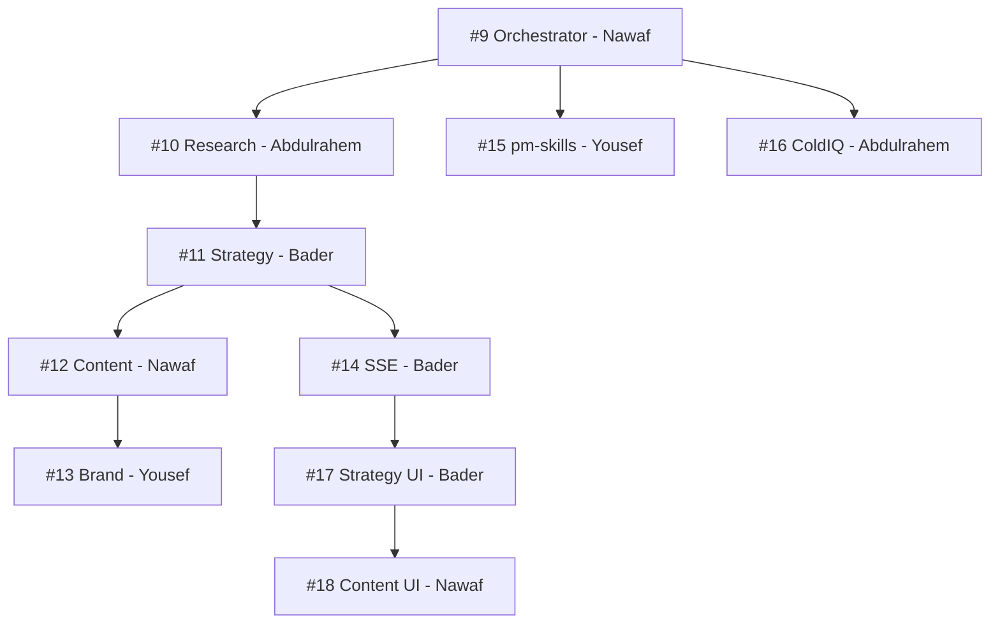

# Epic 2 — Agent Implementation (Redistributed for Bootcamp)

**Goal:** Every team member owns real LangGraph agent nodes AND steps outside their comfort zone — no one stays in just agents, backend, or frontend.

**Target branch:** `staging`

---

## PRs in this Epic

| PR | Title | Owner | Branch | What They Learn |
|----|-------|-------|--------|----------------|
| #9 | Orchestrator node — real routing + conditional edges | **Nawaf** | `epic-5/pr-9-orchestrator` | LangGraph routing logic, state management |
| #10 | Research node — Perplexity MCP + research report generation | **Abdulrahem** | `epic-5/pr-10-research` | MCP tool integration, async search agents |
| #11 | Strategy node — GTM framework via pm-skills prompts | **Bader** | `epic-5/pr-11-strategy` | LangGraph nodes, prompt engineering |
| #12 | Content node — ColdIQ email + LinkedIn generation | **Nawaf** | `epic-5/pr-12-content` | LLM content generation, output validation |
| #13 | Brand alignment node — RAG scoring via pgvector + revision loop | **Yousef** | `epic-5/pr-13-brand` | pgvector embeddings, RAG scoring, self-reflection loops |
| #14 | Backend SSE endpoint — `/strategy/generate/stream` with EventSource | **Bader** | `epic-5/pr-14-sse` | FastAPI async streaming, SSE protocol |
| #15 | pm-skills LangChain tool wrappers | **Yousef** | `epic-5/pr-15-pm-skills` | LangChain tool interface, prompt templates |
| #16 | ColdIQ LangChain tool wrappers | **Abdulrahem** | `epic-5/pr-16-coldiq` | LangChain tool composition, sales prompt frameworks |
| #17 | Strategy UI page — SSE consumption + AgentProgress | **Bader** | `epic-5/pr-17-strategy-ui` | Next.js, TanStack Query, SSE in browser |
| #18 | Content + Knowledge pages | **Nawaf** | `epic-5/pr-18-content-ui` | Frontend with Zustand, Tailwind CSS |

## PR Count Per Person

| Person | Agent node | Tools | Backend | Frontend | Total |
|--------|-----------|-------|---------|----------|-------|
| **Nawaf** | #9, #12 | — | — | #18 | **3** |
| **Bader** | #11 | — | #14 | #17 | **3** |
| **Abdulrahem** | #10 | #16 | — | — | **2** |
| **Yousef** | #13 | #15 | — | — | **2** |

## Review Rotation

- Nawaf's PRs → reviewed by Bader
- Bader's PRs → reviewed by Abdulrahem
- Abdulrahem's PRs → reviewed by Yousef
- Yousef's PRs → reviewed by Nawaf

Full circle. No single reviewer bottleneck.

## Dependency Order

## Acceptance Criteria

- [ ] POST /api/v1/strategy/generate starts a real LangGraph run
- [ ] SSE events arrive at the browser in real time
- [ ] AgentProgress component shows running → complete per node
- [ ] ResearchReport, GTMStrategy, ContentAsset[] persisted to DB after run
- [ ] Brand alignment score > 0.0 on all content assets
- [ ] LangSmith traces visible in LangSmith Cloud dashboard
- [ ] Every team member has merged at least 2 PRs and reviewed 2+ PRs
